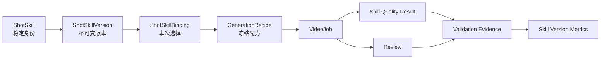

# Shot Skill Card 完整产品化原子任务

状态：实施计划。本文将现有内部 Shot Skill Card A1 运行时升级为具备数据库版本、Workspace 私有卡、结构化编辑器、安全 JSON 导入导出和生产 QA 闭环的团队级产品。

关联文档：

- `docs/product/shot-skill-card-blueprint.md`：完整功能蓝图；
- `docs/product/bulk-sku-production-atomic-tasks.md`：现有 A1 最小运行时任务；
- `docs/product/bulk-sku-production-direction.md`：批量 Pilot、Wave 和止损流程。

## 0. 范围和核心决策

本阶段目标：

> 将现有代码托管的三个内部 Shot Skill 升级为可持久化、可版本化、可由 Workspace 安全创建和复用，并且生成与 QA 均绑定冻结版本的 Shot Skill Card 产品。

明确不做：

```text
公开 Skill 市场
匿名第三方卡片
PNG 内嵌角色卡
卡片执行脚本
卡片远程依赖
任意 URL 读取
卡片覆盖系统 Prompt
自动根据一次拒绝修改卡片
动态向量召回
递归或概率触发
多供应商适配
MiniMax-M3 自动生成卡片
```

### 0.1 最终领域关系



### 0.2 核心不变量

1. `ShotSkill` 是稳定身份，`ShotSkillVersion` 是具体行为。
2. Official Skill 的 `ownerTeamId = null`。
3. Workspace Private Skill 必须绑定 `teamId`。
4. Draft 可以修改；进入 `testing` 后定义冻结。
5. Active 版本不能修改，只能创建后继版本。
6. VideoJob 使用固定 Version，不使用“当前最新版本”。
7. Worker 执行冻结 Recipe，不在执行时重新读取或选择 Skill。
8. 导入只能产生 Private Draft，不能直接 Active。
9. 阻塞 Skill QA 失败的结果不能被采用或进入交付包。
10. Review 和 QA 不得自动修改 Skill 定义。

### 0.3 原子任务规则

- 一个任务只改变一个可观察行为；
- 每个 Private Skill 读写必须显式校验 `teamId`；
- 发布版本不得原地修改；
- 未通过 Eligibility 的 Skill 不得强制入队；
- JSON 导入视为不可信输入；
- QA 必须读取 VideoJob 的冻结 Recipe，而不是 Registry 最新版本；
- 每项任务只运行覆盖自身合同的最小验证；
- 最后才执行端到端真实生成验收。

## A. Skill Card 与 Skill Version 数据库

### A.1 数据模型

`shot_skills`：

```text
id
stable_id
owner_team_id nullable
name
description
created_by
created_at
updated_at
```

`shot_skill_versions`：

```text
id
shot_skill_id
parent_version_id nullable
version
spec_version
status
normalized_definition JSONB
definition_hash
provenance JSONB
created_by
published_at nullable
created_at
updated_at
revision
```

生命周期：

```text
draft
→ testing
→ active
→ deprecated
→ retired
```

Draft 定义可修改；从 `testing` 开始定义不可修改。每个 Skill 最多一个 Active 版本，使用唯一部分索引保证，不保存第二个“当前版本”事实源。

### A.2 原子任务

| ID | 原子任务 | 可验证完成结果 | 前置 |
|---|---|---|---|
| SKDB-01 | 冻结持久化 Shot Skill Schema | 完整卡片有唯一 Zod Schema，拒绝未知顶层字段和系统 Prompt 覆盖字段 | 现有 A1 Schema |
| SKDB-02 | 冻结 Skill 生命周期合同 | 每个合法状态迁移、操作者和失败条件均有确定结果 | SKDB-01 |
| SKDB-03 | 冻结 Official 与 Private 所有权合同 | Official 无团队归属；Private 必须归属 Team；查询规则明确 | SKDB-01 |
| SKDB-04 | 新增 ShotSkill 状态枚举 | PostgreSQL 只接受五种生命周期状态 | SKDB-02 |
| SKDB-05 | 新增 ShotSkill 表 | Official 和当前 Team 的稳定 Skill 身份可以保存 | SKDB-03、SKDB-04 |
| SKDB-06 | 新增 ShotSkillVersion 表 | 定义、父版本、SemVer、Hash、状态和来源可以保存 | SKDB-05 |
| SKDB-07 | 增加 Skill 唯一约束 | Official stable ID 全局唯一；Private stable ID 在 Team 内唯一 | SKDB-05 |
| SKDB-08 | 增加 Version 唯一约束 | 同一 Skill 版本号不可重复；每个 Skill 最多一个 Active 版本 | SKDB-06 |
| SKDB-09 | 实现发布版本不可变保护 | `testing/active/deprecated/retired` 的定义、版本和 Hash 不能更新 | SKDB-06 |
| SKDB-10 | 生成并验证 Drizzle Migration | 空库和现有库升级后结构一致，已有 VideoJob 不受影响 | SKDB-04 至 SKDB-09 |
| SKDB-11 | 导出 Drizzle 推断类型 | ShotSkill 和 ShotSkillVersion Select/Insert 类型可用 | SKDB-10 |
| SKDB-12 | 建立 Team-scoped 查询基元 | Private Skill 查询必须传 `teamId`，不能读取其他 Workspace | SKDB-11 |
| SKDB-13 | 实现创建 Private Draft 操作 | Owner 可以创建 Team 私有 Draft；Member 被拒绝 | SKDB-12 |
| SKDB-14 | 实现复制为新版本操作 | 从现有版本创建带 `parentVersionId` 的 Draft，不覆盖源版本 | SKDB-13 |
| SKDB-15 | 实现 Draft 保存操作 | 只允许修改 Draft；使用递增 `revision` 防止 PostgreSQL 时间精度导致的静默覆盖 | SKDB-13 |
| SKDB-16 | 实现 Draft 到 Testing 迁移 | Schema 通过后规范化定义、计算 SHA-256 并冻结行为字段 | SKDB-02、SKDB-15 |
| SKDB-17 | 实现 Testing 到 Active 迁移 | 只有满足验证门且由 Owner 批准的版本可以 Active | SKDB-16、SKQA-18 |
| SKDB-18 | 实现版本弃用和退役操作 | Active 可 Deprecated；无活跃 Batch 依赖时才能 Retired | SKDB-17 |
| SKDB-19 | 迁移三张内置官方卡 | 三张代码卡以 `1.0.0` Official Active 版本写入数据库且 Hash 一致 | SKDB-10 |
| SKDB-20 | 绑定 ShotSkillVersion 到执行记录 | 新 VideoJob 保存 Version FK，并继续冻结 ID、版本、Hash 和 Recipe | SKDB-10 |

### A.3 数据层验收

以下允许：

```text
product-hero@1.0.0  active
product-hero@1.1.0  draft
```

以下必须失败：

```text
修改 product-hero@1.0.0 的 timeline
修改 product-hero@1.0.0 的 invariants
创建第二个 active 版本
其他 Team 读取 Private Skill
删除已有 VideoJob 引用的版本
```

## B. Dashboard Skill Library

页面结构：

```text
/dashboard/skills
/dashboard/skills/[skillId]
/dashboard/skills/[skillId]/versions/[versionId]
```

Library 列表展示：

```text
名称和版本
Official / Private
状态
适用 Shot Role
素材要求
QA 通过率
采用率
重试率
平均可用结果成本
最后验证时间
```

Detail 展示：

```text
业务目标
适用条件
Camera / Timeline
必须保持
禁止内容
Fallback
Quality Checks
版本历史
Compilation Preview
采用与拒绝原因
```

### B.1 原子任务

| ID | 原子任务 | 可验证完成结果 | 前置 |
|---|---|---|---|
| SKLIB-01 | 新增 Workspace Skill 查询 | 返回 Official Active 和当前 Team Private Skill，不泄露其他 Team 数据 | SKDB-12 |
| SKLIB-02 | 新增 Skill Detail 查询 | 按 Team 范围读取稳定身份、版本和状态 | SKLIB-01 |
| SKLIB-03 | 新增版本历史查询 | 返回父版本、状态、作者、发布时间和 Hash，不返回其他 Team Draft | SKLIB-02 |
| SKLIB-04 | 新增版本指标查询 | 返回 QA、采用、拒绝、重试、成本和样本数，并明确零样本 | SKQA-18 |
| SKLIB-05 | 新增 Dashboard Skills 导航 | Workspace 导航出现 `Shot Skills` | SKLIB-01 |
| SKLIB-06 | 实现 Skill Library 列表 | 页面可区分 Official、Private、Draft、Testing 和 Active | SKLIB-01、SKLIB-05 |
| SKLIB-07 | 实现列表筛选 | 可按 Scope、Status、Shot Role 和素材要求筛选 | SKLIB-06 |
| SKLIB-08 | 实现 Skill Detail 页面 | 可查看 Goal、Eligibility、Timeline、约束、Fallback 和 QA Contract | SKLIB-02 |
| SKLIB-09 | 实现版本历史页面 | 可查看所有可访问版本及父子关系 | SKLIB-03、SKLIB-08 |
| SKLIB-10 | 实现结构化版本 Diff | 按字段显示两个版本的行为变化 | SKLIB-09 |
| SKLIB-11 | 实现 Compilation Preview | 给定受控 Fixture，显示 Skill、Recipe、Trace 和最终 Prompt | SKEDIT-15 |
| SKLIB-12 | 显示性能样本边界 | 指标同时显示样本数；无样本时不显示误导性百分比 | SKLIB-04 |
| SKLIB-13 | 显示 Skill 选择原因 | Campaign/Batch 显示 preferred、fallback 或 eligible 选择原因 | SKCUT-03 |
| SKLIB-14 | 实现 Library RBAC | Member 只读；Owner 才能创建、复制、编辑和发布 | SKDB-13、SKLIB-06 |

Library 不提供巨大 Prompt 文本框。普通用户看到目标、素材要求、稳定行为、禁止项、质量合同和真实指标；原始 Prompt 只出现在运营级 Compilation Preview。

## C. 结构化 Card Editor

编辑器区域：

```text
1. Identity
2. Goal 与 Shot Roles
3. Eligibility
4. Required Inputs
5. Camera / Composition / Motion
6. Timeline
7. Invariants
8. Forbidden
9. Fallback
10. Quality Checks
11. Provider Output
12. Fixture Preview
```

编辑器禁止提供：

```text
System Prompt 输入框
任意 JavaScript
任意远程 URL
绕过 Brand Kit 的开关
关闭商品一致性检查的开关
自定义重试次数
自定义成本上限
```

### C.1 原子任务

| ID | 原子任务 | 可验证完成结果 | 前置 |
|---|---|---|---|
| SKEDIT-01 | 冻结编辑器 Form Schema | UI Form 与持久化 Card Schema 有唯一双向映射 | SKDB-01 |
| SKEDIT-02 | 实现创建 Draft 页面 | Owner 可从空白模板创建 Private Draft；Member 只读 | SKDB-13 |
| SKEDIT-03 | 实现 Identity 编辑区 | 可编辑名称、描述和 stable ID；发布后 stable ID 不可修改 | SKEDIT-01、SKEDIT-02 |
| SKEDIT-04 | 实现 Goal 与 Shot Role 编辑区 | 至少选择一个 Role；空 Goal 无法保存 | SKEDIT-01 |
| SKEDIT-05 | 实现 Eligibility Builder | 使用结构化 `all/any/none` 条件，不扫描自由文本 | SKEDIT-01 |
| SKEDIT-06 | 实现 Required Input Builder | 每个输入声明类型、数量、授权、MIME 和是否阻塞 | SKEDIT-01 |
| SKEDIT-07 | 实现 Camera Grammar 编辑区 | 分别编辑景别、构图、移动、焦点和光线 | SKEDIT-01 |
| SKEDIT-08 | 实现 Timeline Builder | Beat 可排序，范围连续、不重叠并覆盖完整输出 | SKEDIT-01 |
| SKEDIT-09 | 实现 Invariant 与 Forbidden 编辑区 | 每项使用受控 Code 和说明，拒绝互相矛盾的规则 | SKEDIT-01 |
| SKEDIT-10 | 实现 Fallback 编辑区 | 只能引用可访问 Skill，不能引用自身或形成循环 | SKDB-12、SKEDIT-01 |
| SKEDIT-11 | 实现 Quality Check 编辑区 | 只能选择已注册 Check Code，并设置 blocking 或 warning | SKQA-01 |
| SKEDIT-12 | 实现 Provider Output 编辑区 | V1 只允许 MiniMax H3、9:16、768P 和受控时长 | SKEDIT-01 |
| SKEDIT-13 | 实现 Draft 自动校验 | 保存返回精确字段路径和错误码 | SKEDIT-03 至 SKEDIT-12 |
| SKEDIT-14 | 实现 Eligibility Preview | 输入 Fixture 后显示 eligible、ineligible 原因和 fallback | SKEDIT-05、SKEDIT-10 |
| SKEDIT-15 | 实现 Prompt 编译预览 | Fixture 只生成 Preview，不创建 VideoJob 或调用 MiniMax | SKEDIT-08、SKEDIT-09 |
| SKEDIT-16 | 实现 Compilation Trace 预览 | 每个 Recipe 字段显示 Brief、Brand Kit、Spec 或 Skill 来源 | SKEDIT-15 |
| SKEDIT-17 | 实现保存冲突提示 | Draft 被其他请求更新时返回版本冲突，不静默覆盖 | SKDB-15 |
| SKEDIT-18 | 实现提交 Testing 操作 | 校验、规范化和 Hash 成功后才进入 Testing | SKDB-16、SKEDIT-13 |
| SKEDIT-19 | 实现发布审批界面 | 显示 Diff、Fixture、验证证据和阻塞原因后才能 Active | SKDB-17、SKLIB-10 |
| SKEDIT-20 | 实现从现有版本创建 Draft | Official 或 Private 可复制，源版本保持不变并记录来源 | SKDB-14 |

### C.2 Timeline 校验

以下必须拒绝：

```text
0.0–0.4
0.3–0.8   // 重叠

0.0–0.4
0.6–1.0   // 空洞

0.0–0.5
0.5–1.2   // 越界
```

以下允许：

```text
0.0–0.4
0.4–0.8
0.8–1.0
```

## D. JSON 导入与导出

V1 只支持：

```text
*.shot-skill.json
application/vnd.skyhorse.shot-skill+json
```

不支持 PNG metadata、ZIP、远程 URL 导入、自动执行扩展、自动 Active、跨 Workspace 覆盖和未知顶层字段。

安全限制：

```text
最大文件：256 KiB
最大 JSON 深度：20
最大 Timeline Beat：30
最大 Invariant：50
最大 Forbidden：50
最大 Quality Check：30
最大单字段文本：4000 字符
```

`extensions` 可以保留，但必须使用命名空间键，并且不进入 Prompt、Eligibility 或 QA，不执行，也不能携带 URL 或脚本。

### D.1 原子任务

| ID | 原子任务 | 可验证完成结果 | 前置 |
|---|---|---|---|
| SKIO-01 | 冻结 JSON 文件合同 | 文件格式、MIME、扩展名、大小和字段限制有唯一机器合同 | SKDB-01 |
| SKIO-02 | 实现规范化 JSON 导出器 | 相同 Version 始终导出相同字段顺序和内容 Hash | SKIO-01 |
| SKIO-03 | 实现 Team-scoped 导出权限 | 只能导出 Official 或当前 Team 可访问版本 | SKDB-12、SKIO-02 |
| SKIO-04 | 实现导出下载接口 | 文件名包含 stable ID 和 SemVer，不泄露数据库 ID | SKIO-02、SKIO-03 |
| SKIO-05 | 实现导入文件边界校验 | 超大小、错误 MIME、非法扩展名、深度超限在业务解析前失败 | SKIO-01 |
| SKIO-06 | 实现不可信 JSON Schema 校验 | 未知字段、非法版本、空数组和越权字段返回确定路径 | SKIO-05 |
| SKIO-07 | 实现危险字段检查 | `systemPrompt`、脚本、远程依赖、URL 和可执行扩展明确拒绝 | SKIO-06 |
| SKIO-08 | 实现 Extensions 隔离 | 合法扩展可保存，但编译器和 QA 永远不读取 | SKIO-06 |
| SKIO-09 | 实现导入 Preview | 保存前显示 Scope、冲突、Fallback、Schema 错误和目标 Draft | SKIO-06、SKDB-12 |
| SKIO-10 | 实现冲突解决合同 | 同 stable ID 不覆盖；只能选择新版本或 Fork 新 stable ID | SKIO-09 |
| SKIO-11 | 实现导入为 Private Draft | 成功导入只能创建当前 Team Draft | SKDB-13、SKIO-10 |
| SKIO-12 | 实现导入审计日志 | 记录操作者、文件 Hash、创建的 Skill 和 Version | SKIO-11 |
| SKIO-13 | 实现 Import/Export 页面操作 | Library 支持上传、Preview、确认和版本下载 | SKLIB-06、SKIO-04、SKIO-11 |
| SKIO-14 | 验证 Round-trip 稳定性 | Export → Import → Export 后规范化定义一致 | SKIO-02、SKIO-11 |

### D.2 冲突行为

新卡：

```text
stableId 不存在
→ 创建 Private Skill
→ 创建 Draft Version
```

新版本：

```text
stableId 已存在且属于当前 Team
→ 用户选择“作为新版本”
→ 创建 parentVersionId 指向当前版本的 Draft
```

Fork：

```text
导入 Official 或其他来源定义
→ 用户选择 Fork
→ 输入新的 stableId
→ 创建当前 Team Private Draft
```

任何模式都不能覆盖原版本。

## E. 生产 QA 回接 Skill Contract

当前卡片已经声明 `qualityChecks`，但生产 QA 尚未调用卡片检查执行器。本阶段必须将冻结 Skill Contract 接入真实质量流程。

统一 QualityReport 增加：

```ts
type SkillQualityReport = {
  skillId: string;
  skillVersion: string;
  skillHash: string;
  recipeHash: string;
  passed: boolean;
  checks: Array<{
    code: string;
    severity: 'blocking' | 'warning';
    passed: boolean;
    evidence: string[];
  }>;
  blockingFailures: string[];
};
```

### E.1 原子任务

| ID | 原子任务 | 可验证完成结果 | 前置 |
|---|---|---|---|
| SKQA-01 | 冻结 Quality Check Code Registry | 每个 Code 有输入字段、算法、失败分类和用户说明 | 现有 Skill QA |
| SKQA-02 | 冻结 Skill QA Observation Schema | 所有卡片检查只读取结构化观察值 | SKQA-01 |
| SKQA-03 | 扩展统一 QualityReport Schema | Report 保存冻结 Skill 元数据、逐项结果和证据 | SKQA-02 |
| SKQA-04 | 实现冻结 Check 读取 | QA 从 VideoJob `recipeSnapshot` 读取检查，不读取最新 Registry | SKDB-20、SKQA-03 |
| SKQA-05 | 映射技术探测结果 | Codec、比例、时长、音频和可播放状态转为结构化观察值 | SKQA-02 |
| SKQA-06 | 映射商品一致性结果 | 商品数量、形状、颜色、标签和细节证据转为 Observation | SKQA-02 |
| SKQA-07 | 映射场景与时间线结果 | Scene 授权和 Timeline 遵循结果转为受控观察值 | SKQA-02 |
| SKQA-08 | 接入 Skill Quality Evaluator | 每次成功视频进入 QA 时执行冻结 Skill Contract | SKQA-04 至 SKQA-07 |
| SKQA-09 | 实现阻塞失败决策 | 任一 blocking Check 失败时结果不可采用 | SKQA-08 |
| SKQA-10 | 实现 Warning 行为 | Warning 失败保留在报告中，但不单独阻止采用 | SKQA-08 |
| SKQA-11 | 映射统一失败分类 | 商品不变量归 fidelity；时间线归 spec_mismatch；技术失败归 technical | SKQA-08 |
| SKQA-12 | 保存 QA 幂等结果 | 同一 VideoJob 重复提交相同观察不重复创建证据 | SKQA-08 |
| SKQA-13 | 新增 Skill Validation Evidence 表 | Version、VideoJob、证据类型、原因和指标不可变保存 | SKDB-10 |
| SKQA-14 | QA 通过时写入验证证据 | 保存 QA Pass，但不自动视为客户采用 | SKQA-12、SKQA-13 |
| SKQA-15 | Adopt 时写入正面证据 | 只有 QA 通过且用户 Adopt 后才形成 positive candidate | SKQA-09、SKQA-13 |
| SKQA-16 | Reject 时要求结构化原因 | Reject 必须有 failure cause 和 reason，形成 negative candidate | SKQA-13 |
| SKQA-17 | 禁止证据自动修改卡片 | 采用或拒绝后 Version definition 和 Brand Kit 均不变化 | SKQA-15、SKQA-16 |
| SKQA-18 | 实现 Skill Version 指标查询 | 按 Version 和商品类别计算 QA、采用、重试和可用成本 | SKQA-13 至 SKQA-16 |
| SKQA-19 | Review 页面展示 Skill QA | 审批者看到违反的卡片规则及证据 | SKQA-08 |
| SKQA-20 | Skill Detail 展示采用与拒绝原因 | 聚合结果保留样本数且不泄露其他 Team 原始数据 | SKQA-18、SKLIB-08 |
| SKQA-21 | 回接 Production Batch 止损 | 同 Skill Version 重复阻塞失败可以暂停后续 Wave | SKQA-11、现有 Stop-Loss |
| SKQA-22 | 实现 QA Remediation 建议 | 每个失败 Code 唯一映射补素材、改 Spec、改 Skill 或技术重试 | SKQA-01、SKQA-11 |
| SKQA-23 | 验证禁止采用行为 | blocking failure 的 VideoJob 无法 Adopt 或进入导出包 | SKQA-09、SKQA-19 |
| SKQA-24 | 验证负例不会污染 Skill | 单次 Reject 不创建新 Version、不改变 Active Version | SKQA-16、SKQA-17 |

## F. 生产运行时 clean cutover

数据库卡片不能与代码 Registry 长期双轨运行。完成数据和产品能力后执行一次干净切换。

| ID | 原子任务 | 可验证完成结果 | 前置 |
|---|---|---|---|
| SKCUT-01 | 实现数据库 Skill Resolver | 只能解析 Official 或当前 Team 可访问版本 | SKDB-12、SKDB-19 |
| SKCUT-02 | 实现明确版本选择 | 编译入口接收 `shotSkillVersionId`，不只接收 stable ID | SKCUT-01 |
| SKCUT-03 | 绑定 Skill 到内部 ShotCard | 保存 Version ID、选择原因和 Eligibility 结果 | SKCUT-02 |
| SKCUT-04 | 锁定 Batch Skill 版本 | Pilot 与后续 Wave 使用相同 Version；切换使审批和成本确认失效 | SKCUT-03 |
| SKCUT-05 | 切换 Approved Spec 编译器 | 编译器读取绑定 Version，不读取代码 Registry 当前值 | SKCUT-03 |
| SKCUT-06 | 保留历史 Recipe 执行能力 | 旧 VideoJob 依据自身 Snapshot 执行，不依赖版本状态 | SKCUT-05 |
| SKCUT-07 | 删除生产代码 Registry 回退 | 数据库解析失败时明确失败，不回退内置代码卡 | SKCUT-05、SKCUT-06 |
| SKCUT-08 | 删除双轨写入路径 | 新 VideoJob 必须有 Version FK、ID、SemVer、Hash 和 Recipe Snapshot | SKDB-20、SKCUT-05 |
| SKCUT-09 | Worker 验证 Version 一致性 | Version、Skill ID、SemVer、Hash 与 Recipe 不一致时拒绝提交 H3 | SKCUT-08 |
| SKCUT-10 | Campaign 显示 Skill 绑定 | 用户能看到卡名、版本和选择理由，但不能编辑生产 Prompt | SKLIB-13、SKCUT-03 |

## G. 实施阶段与并行边界

```text
P0  合同冻结
    SKDB-01 ～ SKDB-03
    SKIO-01
    SKQA-01 ～ SKQA-03

P1  数据基础
    SKDB-04 ～ SKDB-12
    SKDB-19 ～ SKDB-20

P2  可并行基础能力
    ├── Library 查询：SKLIB-01 ～ SKLIB-04
    ├── Editor 基础：SKEDIT-01 ～ SKEDIT-12
    ├── Import/Export 引擎：SKIO-02 ～ SKIO-12
    └── QA 映射：SKQA-04 ～ SKQA-13

P3  产品操作
    ├── Library UI：SKLIB-05 ～ SKLIB-14
    ├── Editor 工作流：SKEDIT-13 ～ SKEDIT-20
    ├── Import/Export UI：SKIO-13 ～ SKIO-14
    └── QA Evidence：SKQA-14 ～ SKQA-24

P4  生产 clean cutover
    SKCUT-01 ～ SKCUT-10

P5  整体验收
    Workspace Private Skill
    → Draft
    → Testing
    → Active
    → 绑定 Campaign
    → Pilot
    → MiniMax H3
    → Skill QA
    → Adopt/Reject
    → Library Metrics
    → JSON Export
```

### G.1 严格依赖

- Editor 保存必须等待数据库 Draft 操作；
- Testing 发布必须等待规范化 Hash；
- Active 发布必须等待验证证据；
- Production Cutover 必须等待三个 Official Skill 已迁移；
- Skill QA 必须读取冻结 Recipe；
- Metrics 必须等待 QA 和 Review Evidence；
- 导入必须等待 Private Draft 写操作；
- 删除代码 Registry 回退必须等待数据库 Resolver 生效。

## H. 端到端验收场景

### H.1 创建

```text
Owner
→ Shot Skills
→ New Private Skill
→ 创建 product-glass-reflection
```

### H.2 编辑

```text
适用：fragrance + detailImageCount >= 1
Camera：controlled studio macro
Timeline：0–0.4 / 0.4–0.8 / 0.8–1
Invariant：preserve bottle geometry
Forbidden：additional product
QA：single_product blocking
```

### H.3 发布

```text
Draft
→ Schema 通过
→ Fixture 通过
→ Testing
→ 验证证据满足
→ Owner Active
```

### H.4 生产

```text
Creative Spec
→ Skill Eligibility 通过
→ 绑定明确 Version
→ 生成 Recipe
→ 保存 Hash 与 Snapshot
→ Worker 调用 MiniMax H3
```

### H.5 QA

```text
Video succeeded
→ Skill QA 执行
→ single_product = true
→ product_shape_preserved = true
→ Skill QA passed
```

### H.6 Review

```text
用户 Adopt
→ 创建 positive evidence
→ Library 采用率变化
→ Skill 定义不自动变化
```

另一个结果：

```text
用户 Reject
→ 必须填写结构化原因
→ 创建 negative evidence
→ Skill 定义不自动变化
```

### H.7 导入导出

```text
Export product-glass-reflection@1.0.0
→ JSON
→ 导入到同 Team
→ 选择 Fork
→ 创建新的 Private Draft
→ 原版本保持不变
```

## I. 最终完成标准

1. 用户能看到 Official 与 Private Skill Library。
2. Owner 能通过结构化编辑器创建 Private Draft。
3. Published Version 无法被原地修改。
4. JSON 导入永远只创建 Private Draft。
5. 新 VideoJob 绑定明确数据库 Version。
6. Batch Pilot 与后续 Wave 不会静默切换 Version。
7. Worker 只执行冻结 Recipe。
8. Production QA 真正执行卡片 `qualityChecks`。
9. Blocking Check 失败的视频不能 Adopt 或导出。
10. Adopt 和 Reject 形成不同 Evidence。
11. 一次 Reject 不会自动修改 Skill。
12. Library 指标按版本、商品类别和样本数展示。
13. 旧 VideoJob 仍能依据自身 Snapshot 重现。
14. 生产代码不存在数据库 Registry 与代码 Registry 双轨回退。
15. 一个真实 Workspace Private Skill 完成创建、发布、生成、QA、审批和导出闭环。
