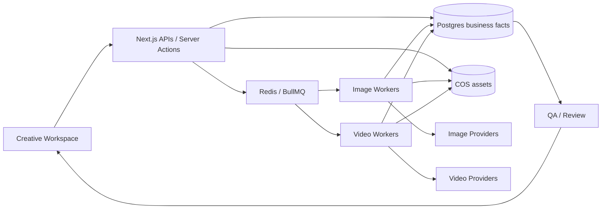

# Skill 驱动媒体生产工作台：长期产品愿景

状态：产品北极星。本文描述理想终局，不代表所有能力同时进入当前实施范围。

关联文档：

- `docs/product/bulk-image-to-video-current-phase-plan.md`：下一阶段必须完成的百图批量转视频闭环；
- `docs/product/google-flow-inspired-workspace-atomic-tasks.md`：创作工作区 UI/UX 原子计划；
- `docs/product/initial-version.md`：SKU 电商视频初版范围；
- `docs/product/customer-workflow-optimization-atomic-tasks.md`：已完成的 SKU 客户闭环；
- 分析来源：客户真实 Skill《Documentary Paper Collage Workflow Framework》。

## 1. 产品主旨

> 为有明确内容规则、品牌约束和批量生产需求的团队，提供一个由 Skill 驱动、资产优先、阶段可审、任务可追溯的 AI 媒体生产工作台。

平台不与 MiniMax、Veo 或图像模型竞争底层生成能力。平台负责：

- 决定生成什么；
- 冻结哪些规则；
- 组织输入素材；
- 把长目标拆成可验证的生产单元；
- 在昂贵生成前设置人工 Gate；
- 批量调度和失败恢复；
- 记录成本、Recipe、QA 和 Review；
- 交付最终可用的媒体资产。

## 2. 第一性原理

### 2.1 AI 媒体生产的核心不是一次生成，而是受控收敛

真实生产不会一次命中。它需要：

```text
意图
→ 规则
→ 中间 Artifact
→ 人工判断
→ 生成
→ 比较
→ 采用或返工
```

产品价值不应以“能否调用模型”衡量，而应以以下结果衡量：

- 客户是否更少重复输入；
- 错误是否更早被发现；
- 返工是否只影响必要范围；
- 已批准成果是否不会被意外覆盖；
- 批量任务是否可以离开页面继续执行；
- 任何结果是否可以解释和复现；
- 团队是否知道什么可交付、什么仍有风险。

### 2.2 高成本阶段必须由低成本证据解锁

通用生产梯度：

```text
文本决策
< Prompt / Spec
< 单图
< Pilot 视频
< 批量视频
< 最终合成
```

越往后成本越高，越需要前置 Gate。系统不能因为技术上可以“一键全部生成”就鼓励用户跳过判断。

### 2.3 工作流由 Artifact 推进，不由聊天记录推进

聊天可以帮助创作，但不能成为唯一业务事实。

每个阶段必须产出结构化、版本化 Artifact：

```text
Idea Selection
Narration Version
Beat Map
Image Prompt Set
Adopted Image Set
Motion Skill Version
Video Clip Set
Review Decision
Delivery Manifest
```

用户刷新页面、换成员或一周后回来，仍然知道当前批准了什么、下一步是什么。

### 2.4 Skill 是可执行创意合同，不是 Prompt 收藏夹

一个 Skill 至少定义：

- 适用输入；
- 目标；
- 时间结构；
- 镜头与运动规则；
- 必须保持的元素；
- 禁止项；
- Provider 能力要求；
- 输出合同；
- QA 检查；
- 版本与来源。

Skill 被发布后不可静默修改。生产任务绑定明确版本和 definition hash。

### 2.5 共享规则只保存一次，差异只保存在最小单元

通用表达：

```text
Project Rules
+ Stage Skill
+ Item Context
+ Optional Override
= Frozen Recipe
```

不要为 100 个 Item 复制 100 份相同 Prompt；不要把单项差异反向写入公共规则。

### 2.6 人工控制点必须少而关键

不是每一个数据库写入都需要审批。人应该只在以下节点介入：

- 选择方向；
- 锁定规则；
- 批准高成本生成；
- 评价结果；
- 决定返工边界；
- 确认最终交付。

其余创建、绑定、排队、轮询、命名、归档和汇总应自动完成。

## 3. 市场定位：电商为楔子，媒体生产内核可跨垂类

### 3.1 近期商业定位

继续聚焦 SKU 电商：

- 有明确批量需求；
- 商品素材结构稳定；
- Brand Kit 和保真 QA 有直接价值；
- 视频可与 SKU、Campaign 和采用结果关联；
- 成本、吞吐和返工容易量化。

默认产品语言继续使用：

```text
SKU
Brand Kit
Campaign
Product fidelity
Approved claims
Batch production
```

### 3.2 长期内核

不同垂类最终都可归约为：

```text
Project
→ Rules / Skill
→ Ordered Production Items
→ Input Assets
→ Frozen Recipes
→ Async Jobs
→ Output Assets
→ QA
→ Review
→ Delivery
```

| 垂类 | Project | Production Item | Input | Shared Skill | Override |
|---|---|---|---|---|---|
| 电商 | SKU Campaign / Batch | SKU | 商品图 | 品牌镜头 Skill | 单 SKU 场景或卖点 |
| 纪录片 | Documentary Project | Visual Beat | 最终构图 | 拼贴 Motion Skill | 单 Beat 运动修正 |
| 房地产 | Listing Project | Room shot | 房间照片 | 房产镜头 Skill | 房间类型差异 |
| 教育 | Lesson Project | Concept scene | 图表或插图 | 教学解释 Skill | 单知识点重点 |
| 社媒 | Content Series | Post clip | 主图/人物 | 栏目 Motion Skill | 单集内容 |

### 3.3 抽象边界

现在不建设通用节点工作流引擎。只有当至少两条真实生产路径稳定后，才提炼公共接口。

优先顺序：

1. SKU 电商闭环；
2. 百图批量转视频；
3. Documentary Visual Beat 闭环；
4. 从真实重复中提炼 `ProductionItem`、`StageArtifact` 和 `SkillExecution`；
5. 最后才考虑可配置 Workflow Definition。

抽象必须来自重复事实，不来自想象。

## 4. 理想用户工作流

### 4.1 电商 SKU 工作流

```text
Workspace
→ Brand Kit
→ SKU Catalog
→ 上传商品图与细节图
→ 创建 Single 或 Bulk Production
→ 自动 Campaign / Creative Spec
→ 选择 Shot Skill
→ Eligibility
→ 批准 Spec
→ 成本确认
→ Pilot
→ QA / Review
→ Wave
→ Stop-loss
→ adopted 输出
→ 下载或导出 manifest
```

### 4.2 百图转视频工作流

```text
创建 Image-to-Video Batch
→ 上传 100+ 图片
→ 一个 Shared Prompt / Motion Skill
→ 任意 Item 可设 Custom Prompt
→ Pilot
→ 批量 Queue
→ 失败恢复
→ Media Grid Review
→ adopted 下载
```

### 4.3 Documentary Paper Collage 工作流

```text
State 0  加载来源 PDF、写作与视觉规则
State 1  选择 Niche
State 2  生成十个 Idea 并选择一个
State 3  锁定整片时长与 Beat 预算
State 4  生成连续 Narration 并审批
State 5  生成或上传 Voiceover
State 6  把 Narration 拆成带时间码的 Visual Beats
State 7  每个 Beat 生成自包含图片 Prompt
         → 批量生成图片
         → 人工采用图片
State 8  一个 Universal Motion Skill 应用到全部 Beat
         → Pilot Clips
         → 批量 Clips
         → QA / Review
State 9  生成 Thumbnail Prompt 与候选图
Delivery 导出 adopted clips、Voiceover、Beat manifest 或最终合成
```

阶段规则：

- 一次只突出一个当前决策；
- 每阶段产生一个明确 Artifact 类型；
- 未批准阶段不能解锁高成本下游；
- `redo [state]` 不删除其他已批准成果；
- 上游变更只把真正受影响的下游标记为 stale；
- 用户决定是否重新生成 stale 产物。

## 5. 理想领域模型

### 5.1 身份、组织与财务

```text
Organization / Team
Membership
Role
ActivityLog
CreditLedger
```

原则：

- 所有业务对象绑定 Workspace；
- Owner / Member 保持简单；
- 额度由账本聚合，不直接修改余额；
- Reservation、Settlement、Refund、Adjustment 全部幂等。

### 5.2 Project 与阶段 Artifact

```text
MediaProject
  id
  teamId
  projectType
  title
  status
  activeStage
  rulesSnapshot

StageArtifact
  projectId
  stage
  artifactType
  version
  status: draft | awaiting_review | approved | rejected | stale
  payload
  artifactHash
  parentArtifactIds
  createdBy / approvedBy
```

`StageArtifact` 是长期愿景，不要求当前阶段立即通用化。它的价值是统一表达 Narration、Beat Map、Prompt Set 和 Delivery Manifest 的版本与依赖。

### 5.3 Visual Beat

```text
VisualBeat
  projectId
  sequence
  startMs
  endMs
  exactNarration
  visualIdea
  imagePrompt
  imagePromptStatus
  adoptedImageAssetId
  motionPromptMode
  motionPromptOverride
  latestVideoJobId
  reviewStatus
```

关键不变量：

- `sequence` 在同一 Project 唯一；
- 时间码单调且不重叠；
- `exactNarration` 保存原文，不被图片 Prompt 改写；
- 没有 adopted Image 不能进入视频批量生成；
- 默认继承 Project Motion Skill；
- 单项 Override 必须显式。

### 5.4 Asset 与生成 Job

```text
Asset
  uploaded / generated
  image / audio / video / document
  objectKey
  content metadata
  provenance

ImageJob
  itemId
  provider
  recipeSnapshot
  externalTaskId
  status
  outputAssetId

VideoJob
  itemId
  provider
  recipeSnapshot
  externalTaskId
  status
  outputAssetId
```

上传 Asset 和生成 Asset 使用同一资产库，但生成 Job 独立记录供应商状态、成本、错误和 Recipe。

### 5.5 Shared Skill、Override 与 Recipe

```text
SkillVersion
  normalizedDefinition
  definitionHash
  providerRequirements
  qualityChecks

ItemOverride
  itemId
  field
  value
  reason

GenerationRecipe
  projectRulesHash
  artifactDependencies
  skillVersionId
  skillDefinitionHash
  itemContext
  effectivePrompt
  providerParameters
  inputAssetIds
  recipeHash
```

临时签名 URL 永远不进入稳定 Recipe hash。

## 6. 理想系统架构



### 6.1 Postgres 是业务事实源

保存：

- Project、Artifact、Item；
- Skill 与 Recipe；
- Job 状态镜像；
- 成本账本；
- QA 与 Review；
- 活动日志。

### 6.2 BullMQ 是执行协调器

负责：

- 排队；
- 并发；
- 延迟轮询；
- Retry；
- backoff；
- stalled recovery；
- Worker 横向扩展。

Redis 不是最终业务状态源。Worker 重启后必须可以从 Postgres 与供应商 task ID 恢复观察。

### 6.3 对象存储保存全部媒体产物

- 原始上传；
- 生成图片；
- 生成视频；
- Voiceover；
- Thumbnail；
- 导出包；
- Stage Artifact 附件。

数据库只保存对象键和元数据；客户端使用短期授权 URL。

### 6.4 Provider Adapter 保持中立语义

平台内部表达：

```text
reference image
ingredients
first frame
last frame
text prompt
output duration
ratio
resolution
```

供应商 Adapter 负责能力映射。UI 不直接暴露供应商特有字段，除非用户进入 Advanced Inspector。

## 7. 理想 UI/UX

### 7.1 双壳结构

管理壳继续服务：

- Workspace；
- Billing；
- Security；
- Members；
- Catalog；
- Brand Kits；
- Activity Logs。

创作壳服务：

- Project；
- Story / Brief；
- Beats / Items；
- Assets；
- Generate；
- Queue；
- Review；
- Export。

不把整个 SaaS 强行改造成深色创作工具。

### 7.2 创作工作区布局

```text
Project stage rail
+ Media-first canvas/grid
+ Context inspector
+ Persistent shared prompt/action bar
+ Queue and cost status
```

核心原则：

- 媒体对象是主角；
- 内部数据库字段退到诊断区；
- 当前阶段只有一个主操作；
- 多选和批量操作是一等能力；
- Shared 与 Custom 差异始终可见；
- 失败原因显示在对应媒体项上；
- 页面刷新不丢失队列和选择结果。

### 7.3 不做自由节点画布

当前流程高度有序。节点图会增加连接、缩放、布局和调试负担，却没有改善百图批量生成。

首选：

```text
阶段导航 + 有序媒体网格 + Inspector + Queue
```

只有当用户确实需要任意分支、合并和循环时再考虑节点图。

## 8. 质量系统愿景

### 8.1 技术 QA

- 可播放；
- 编码；
- 时长；
- 画幅；
- 分辨率；
- 音轨；
- 文件完整性。

### 8.2 电商 QA

- 商品数量；
- 包装；
- Logo；
- 颜色；
- 形状；
- 已批准 Claim；
- 禁用元素；
- CTA；
- 结束帧商品可见。

### 8.3 Documentary QA

- Beat 对应 Narration；
- 视觉主体正确；
- 风格块一致；
- 重复人物/物体描述一致；
- 构图保持；
- 禁止相机运动；
- 纸片运动符合 Skill；
- 文字未漂移；
- Clip 时长与 Beat 匹配；
- Voiceover 和 Timeline 可对齐。

### 8.4 QA 不能取代人审

自动 QA 负责筛查明显错误。Review 负责创意判断：

```text
adopted
rejected
needs_changes
```

拒绝原因必须结构化，以支持 Skill 改进、Stop-loss 和供应商比较。

## 9. 批量生产愿景

### 9.1 Pilot

选择少量代表性 Item，验证：

- Prompt adherence；
- 风格；
- 保真；
- 成本；
- 失败率；
- 输出可用性。

### 9.2 Wave

Pilot 通过后按稳定顺序分 Wave。每个 Wave 完成后观察：

- adopted 比例；
- 拒绝原因集中度；
- supplier error rate；
- fidelity failure；
- 实际平均成本；
- 平均完成时间。

### 9.3 Stop-loss

达到阈值自动暂停新调度，但不伪造对运行中外部任务的取消。

暂停后用户获得：

- 触发原因；
- 受影响 Item；
- 已消费成本；
- 可执行修复；
- Resume / Exclude / Regenerate / Cancel pending。

## 10. Rework 与依赖失效

上游 Artifact 变化后，系统计算影响范围：

```text
Narration 修改
→ 受影响 Beats stale
→ 对应 Image Prompts stale
→ 对应未提交 ImageJobs 使用新 Recipe
→ 已生成图片保留但标记 outdated
→ 用户决定是否重生
```

禁止：

- 静默删除旧产物；
- 自动重跑全部下游并产生不可控成本；
- 只用最新字段覆盖历史 Recipe；
- 把“已过期”伪装成“失败”。

## 11. 与 ZAPI FLOW 和 Google Flow 的关系

### 11.1 ZAPI FLOW 的启示

它证明用户强烈需要：

- 一行一个 Prompt；
- 批量排队；
- 清晰状态；
- 自动等待；
- 自动命名和下载。

短期可提供兼容桥：

```text
平台导出编号 Prompt TXT
→ ZAPI FLOW 生成图片
→ 平台按编号批量导入
```

长期应接入正式 Image Provider API，不依赖第三方网页 DOM 自动化。

### 11.2 Google Flow 的启示

Google Flow 的价值不只是模型，而是把 Ingredients、Frames、Extend、Insert、Remove 和媒体结果组织在同一个创作空间中。

本平台不复制全部能力，而吸收其产品原则：

- 媒体优先；
- Prompt 与资产同屏；
- 结果可继续操作；
- 上下文不因跳页丢失；
- 生成、编辑和 Review 构成连续循环。

## 12. 分阶段路线

### 当前阶段

```text
100+ 图片上传
→ Shared Prompt
→ 单项 Override
→ Pilot
→ 批量 VideoJob
→ Review
→ Export
```

### 下一阶段

```text
ImageJob Provider
→ Prompt TXT / CSV
→ 原生批量图片
→ adopted Image Gate
```

### Documentary 阶段

```text
NarrationVersion
→ VisualBeat
→ Image Prompt Set
→ ImageJob
→ Shared Motion Skill
→ ClipJob
→ Beat Review
→ Manifest
```

### 合成阶段

```text
Voiceover
→ Timeline validation
→ FFmpeg assembly
→ Captions
→ Final QA
→ Master Asset
```

### 多 Provider 阶段

仅在真实需求出现后加入：

- Provider capability matrix；
- 模型路由；
- 成本/质量比较；
- fallback；
- Provider-specific Advanced Controls。

## 13. 长期成功指标

### 生产效率

- 每 100 个 Item 所需人工点击数；
- 从 Ready 到全部终态的时间；
- 用户主动等待页面的时间；
- 批量操作覆盖率；
- 失败项单独恢复率。

### 质量与浪费

- Pilot 后批量 adopted rate；
- Stop-loss 避免的预计成本；
- 因上游错误导致的重生比例；
- 同一 Skill 版本的稳定性；
- 主要拒绝原因分布。

### 产品可用性

- 无需支持人员完成首批生产的 Workspace 比例；
- 用户能否在不理解数据库 ID 的情况下完成交付；
- 页面刷新后的恢复成功率；
- manifest 与输出追溯完整率。

## 14. 长期明确不做或延后

除非真实客户需求证明必要，否则不做：

```text
自托管基础模型
自建 GPU 推理平台
无限自由节点编排
完整 Premiere / Resolve 替代品
Prompt 社交市场
自动替用户做所有创意采用决定
用聊天记录代替结构化业务事实
允许覆盖历史 Recipe
跳过成本确认的批量生成
把网页自动化插件作为核心供应商接口
```

## 15. 北极星体验

最终用户应该可以说：

> 我把品牌、素材和生产规则交给系统。系统帮我把目标拆成清楚的生产单元，在昂贵步骤前让我做关键判断，然后在后台完成几十或几百个生成任务。我回来时只需要处理失败项、比较结果并交付采用素材。

这比“又一个 AI Prompt 页面”更难，但也更有长期价值。
